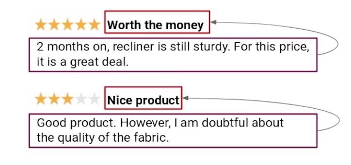

# 67-212 Homework 4
## Summarization of Customer Reviews

In this homework, you will work on the customer reviews of products available at online marketplaces. Managing and mining these reviews can be a tricky and cumbersome task. Let's say you are working as an NLP expert for an online marketplace such as an apparel company that accepts customer reviews. However, there are too many reviews to handle and some of them are very long. So it is difficult to go through all of them. Your task is to build an automatic title (summary) generator for customer reviews. Below is a sample of reviews and their corresponding titles.

In this notebook, you will build a deep neural network that functions as part of an end-to-end text summarization pipeline, using the Python version of the [OpenNMT toolkit]. Your completed system will accept a given product review as input and outputs a title summarizing it.

This homework is organized into 4 main parts:

1. **Preprocess** - You'll clean your text and split it into training, development, and testing sets.
2. **Modeling** Use OpenNMT to create a model that accepts a review (sequence of words) as input and returns a title summarizing it.
3. **Prediction** Run the model on the Test set.
4. **Evaluation** Evaluate the quality of the system using the ROUGE metric.
